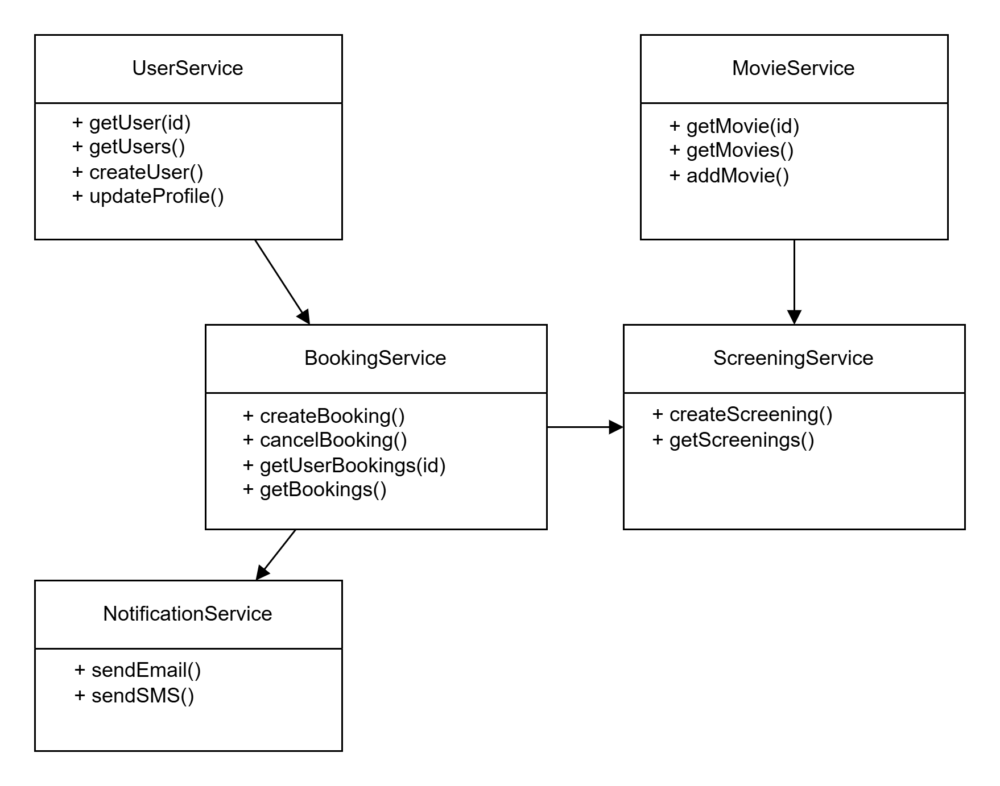
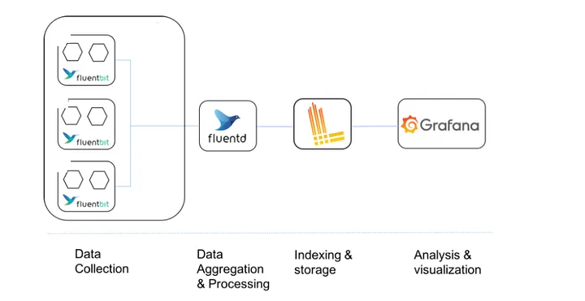

# Kino jako system mikroserwisów

**Autorzy:** Michał Kobiera, Szymon Ożóg, Aleksandra Poskróbek, Wiktor Satora  
**Rok:** 2025  
**Grupa:** gr.4


## 1. Wprowadzenie

Celem naszego projektu jest stworzenie mikroserwisowej aplikacji dla kina, umożliwiającej użytkownikom:

- przegląd repertuaru,
- rezerwację biletów,
- zarządzanie salami i pokazami przez pracowników kina.

Aplikacja zostanie zrealizowana w architekturze mikroserwisowej w celu zapewnienia:

- skalowalności,
- rozdzielenia odpowiedzialności,
- możliwości łatwego rozszerzania systemu.

Kluczowym aspektem projektu jest implementacja efektywnego systemu monitoringu i logowania opartego na technologii **Fluent Bit**, która będzie zbierać, przetwarzać i przesyłać logi z poszczególnych mikroserwisów. Fluent Bit to lekki i wydajny agent przetwarzający logi, który będzie pełnił kluczową rolę w naszym systemie monitoringu. Jego zadaniem będzie:

1. **Kolekcja logów** - zbieranie danych logowych z wszystkich mikroserwisów (UserService, MovieService, BookingService itd.)
2. **Filtrowanie i przetwarzanie** - parsowanie i wzbogacanie danych logowych
3. **Agregacja** - grupowanie i buforowanie logów przed wysłaniem
4. **Przekierowanie** - wysyłka przetworzonych logów do systemu Loki

Dane będą przepływać przez następujący pipeline monitoringu:
`Fluent Bit → Loki → Grafana`

Gdzie:
- **Loki** będzie służyć jako skalowalne repozytorium logów
- **Grafana** zapewni wizualizację danych i tworzenie dashboardów monitorujących działanie systemu

Taka architektura monitoringu pozwoli nam na:
- Centralne zarządzanie logami z wszystkich mikroserwisów
- Szybkie wykrywanie i diagnozowanie problemów
- Monitorowanie wydajności poszczególnych komponentów systemu
- Tworzenie niestandardowych wizualizacji i alertów


## 2. Teoretyczne tło / Stos technologiczny

Nasza architektura mikroserwisowa będzie oparta o następujące komponenty i technologie:

- **Język programowania:** Python + Flask (REST API)
- **Baza danych:** Mockowane dane / JSON
- **Komunikacja między serwisami:** REST (HTTP)
- **Monitoring i logowanie:** Fluent Bit + Loki + Grafana
- **Zarządzanie kontenerami:** Docker + Docker Compose

### Przykładowe mikroserwisy:

- **UserService** – zarządza kontami użytkowników
- **MovieService** – zarządza repertuarem filmowym
- **BookingService** – obsługuje rezerwacje biletów
- **ScreeningService** – planuje seanse w salach kinowych
- **NotificationService** – wysyła powiadomienia e-mail/SMS


## 3. Opis koncepcji studium przypadku

### Założenia systemu:

- Pracownik kina dodaje film i planuje seanse (dzień, godzina, sala).
- Użytkownik rejestruje się, loguje, przegląda dostępne seanse.
- Rezerwacja biletu blokuje miejsce na określony czas.
- Po potwierdzeniu rezerwacji zostaje wygenerowany bilet.
- Powiadomienia e-mail potwierdzają zakup biletu.


## 4. Architektura rozwiązania







## 5. Opis konfiguracji środowiska

### Struktura katalogów
<pre> 
├── docker-compose.yml
├── fluentbit/
│   └── conf/
│       ├── fluent-bit.conf
│       └── parsers.conf
├── user_service/
│   └── user_service.py
├── movie_service/
│   └── ...
...
</pre>

### Dostępne porty
| Usługa                | Adres URL              |
|------------------------|------------------------|
| `user_service`         | http://localhost:5001 |
| `movie_service`        | http://localhost:5002 |
| `booking_service`      | http://localhost:5003 |
| `screening_service`    | http://localhost:5004 |
| `notification_service` | http://localhost:5005 |
| `Grafana`              | http://localhost:3000 |
| `Loki`                 | http://localhost:3100 |

### Logowanie i monitoring
- **Fluent Bit** monitoruje pliki logów kontenerów i przekazuje je dalej w czasie rzeczywistym z `/var/lib/docker/containers` i przesyła je do Loki
- **Loki** zbiera logi i udostępnia je Grafanie
- **Grafana** pozwala filtrować logi na podstawie etykiet (`container_name`, `job=fluentbit`, itp.)

## 6. Instalacja

Do poprawnego uruchomienia środowiska wymagane są:

### Wymagania systemowe:
- Docker (https://www.docker.com/)

- Docker Compose (https://docs.docker.com/compose/)

### Kroki instalacyjne:
1. Klonowanie repozytorium:

```bash
git clone https://github.com/SzymixOz/suu.git
cd suu
```

2. Przygotowanie dodatkowych dashboardów:
Umieść pliki .json dashboardów w folderze:

```bash
./grafana/dashboards/
```

## 7. Reprodukcja – krok po kroku

1. Budowa i uruchomienie kontenerów:
W katalogu głównym projektu uruchom:

```bash
docker-compose up --build
```

2. Dostęp do usług zgodnie z portami podanymi w punkcie 5.

## 8. Demo


### Konfiguracja
### Przygotowanie danych
### Uruchomienie
### Prezentacja wyników
## 9. Zastosowanie AI w projekcie
## 10. Podsumowanie - wnioski
## 11. Źródła/Referencje


